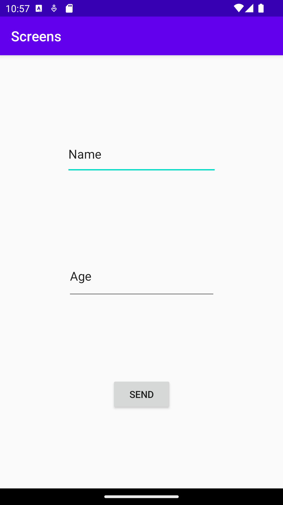
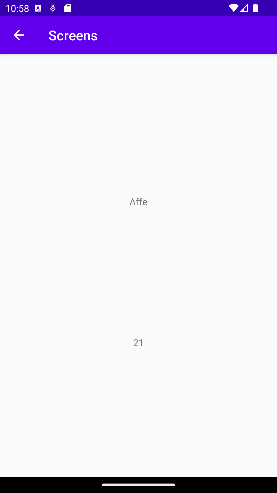

# Rapport

Jag började med att skapa en ny activity som jag döpte till "taEmotData.java"
Sedan skapade jag en ny layout i layout mappen med två text fällt som är till för att
ta emot datan som skickas från första layouten.
```
...
 <TextView
        android:id="@+id/textViewNamn"
        android:layout_width="wrap_content"
        android:layout_height="wrap_content"
        android:text="TextView"
        app:layout_constraintStart_toStartOf="parent"
        app:layout_constraintEnd_toEndOf="parent"
        app:layout_constraintTop_toTopOf="parent"
        app:layout_constraintBottom_toBottomOf="@id/textViewAge"
        />
...
```
Sedan lade jag till möjligheten att skicka data från första sidan till den andra
med hjälp a en intent bundle och så gjorde jag så att det är texten som man skrivit in på första
sidan som följer med till andra och inte bara en förbestämd text sträng.
```
...
Button sendButton = findViewById(R.id.sendButton);

        sendButton.setOnClickListener(new View.OnClickListener(){
            @Override
                public void onClick(View View){
                    Intent intent = new Intent(MainActivity.this, taEmotData.class);
                    EditText nameEdit = findViewById(R.id.editTextName);
                    EditText ageEdit = findViewById(R.id.editTextAge);

                    String name = nameEdit.getText().toString();
                    String age = ageEdit.getText().toString();

                    intent.putExtra("name", name); // Optional
                    intent.putExtra("number", age); // Optional
                    startActivity(intent);
            }
...
```
Efter detta så lade jag till möjligheten att gå tillbaka till första sidan från den andra sidan
utan att behöva starta om appen. Detta gjorde jag genom att lägga till en "parentActivityName"
i manifestet där som säger att "taEmotData"s parent är "MainActivity"
```
android:parentActivityName=".MainActivity"
```
Därefter så använde jag mig av intents och extras för att det skulle gå för användaren av appen att
skriva in sitt namn och ålder och att denna data hamnar i text view fälten på taEmotData sidan.
```
Bundle extras = getIntent().getExtras();
        if (extras != null) {
            String name = extras.getString("name");
            int number = extras.getInt("age");
            // Do something with the name and number

            TextView nameView = findViewById(R.id.textViewNamn);
            nameView.setText(name);

            TextView ageView = findViewById(R.id.textViewAge);
            ageView.setText(String.valueOf());
        }
```
Sist men inte minst så gjorde jag så att all data presenterades korrekt på taEmotData sidan.
jag gjorde så att åldern man skriver in som sparas i variabeln "age" displayas som en string
för att slippa översätta den till en int eftersom jag insåg att rutan som man skriver in åldern i
var en vanlig textEdit. Detta gjordes med hjälp av dessa kod snuttar 
```
...
String age = extras.getString("age");
...
 ageView.setText(age);
...
```



